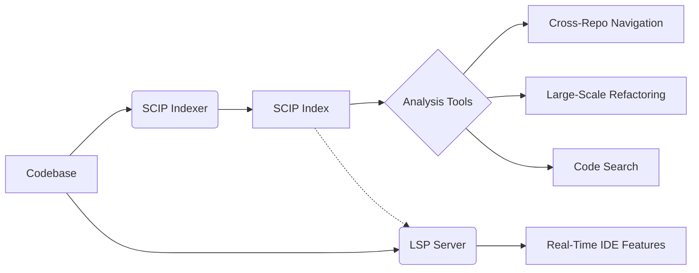

# SCIP Index Generator for Code Repositories


A production-grade tool for generating SCIP indexes of code repositories at specific commits, enabling advanced code analysis and cross-repository navigation capabilities.

## 📖 Overview

This script automates the creation of [SCIP](https://github.com/sourcegraph/scip) (Semantic Code Intelligence Protocol) indexes for arbitrary Git repositories at specific commits. It generates machine-readable snapshots of code structure and relationships in JSON format.

## 🎯 Purpose

- **Code Intelligence Preservation**: Capture code semantics at specific development milestones
- **Cross-Repository Analysis**: Enable navigation between related codebases
- **Historical Investigation**: Analyze code relationships at arbitrary points in history
- **IDE Experience at Scale**: Power editor-like features across massive codebases

## ✨ Key Features

- **Commit-Precise Indexing**: Analyze code at exact Git commits
- **Workspace Isolation**: Self-contained environment for reproducible results
- **Automated Dependency Management**: Handles toolchain installation
- **Memory-Optimized Processing**: 8GB heap allocation for large codebases
- **Validation & Formatting**: JSON output verification and pretty-printing

## 📋 Prerequisites

- Ubuntu/Debian-based system
- Git 2.25+
- Bash 5.0+
- sudo privileges for package installation

## 🛠️ Installation

```bash
curl -O https://raw.githubusercontent.com/yourusername/code-indexer/main/generate_scip.sh
chmod +x generate_scip.sh
```

## 🚀 Usage

```bash
./generate_scip.sh <repository-url> <commit-hash>
```

### Example (Astropy Analysis)
```bash
./generate_scip.sh https://github.com/astropy/astropy.git 1a2b3c4d5e
```

## 🔍 Understanding SCIP and LSP

### SCIP (Semantic Code Intelligence Protocol)
- **Cross-Repository Index Format**: Compact binary representation of code semantics
- **Batch-Optimized**: Designed for whole-program analysis
- **Language Agnostic**: Supports multiple programming languages
- **Offline Capable**: Precomputed indexes enable fast queries

### LSP (Language Server Protocol)
- **Real-Time Protocol**: Optimized for editor interactions
- **Dynamic Analysis**: Provides live code intelligence
- **Session-Based**: Maintains in-memory project state
- **Network-Optimized**: Designed for request/response patterns

### Key Relationship


SCIP and LSP complement each other:
1. **SCIP** provides global, persistent code intelligence
2. **LSP** offers local, interactive analysis
3. SCIP indexes can enhance LSP performance through precomputed data

## 📂 Output Files

| File                      | Format       | Purpose                          |
|---------------------------|--------------|----------------------------------|
| `index.scip`              | SCIP Binary  | Primary index format            |
| `raw_snapshot.json`       | JSON         | Raw SCIP index dump             |
| `formatted_snapshot.json` | Pretty JSON  | Human-readable code analysis    |

## ⚙️ Customization

1. **Memory Allocation**: Adjust `--max-old-space-size` in script
2. **Dependency Versions**: Modify package install commands
3. **Workspace Location**: Change `WORKSPACE_DIR` variable

## 🚨 Troubleshooting

**Error**: Permission denied during install  
**Fix**: Ensure sudo privileges and run:
```bash
sudo chown -R $(whoami) /usr/local/lib/node_modules
```

**Error**: Memory exhaustion during indexing  
**Fix**: Increase Node.js heap size:
```bash
NODE_OPTIONS="--max-old-space-size=16384" scip-python index ...
```

